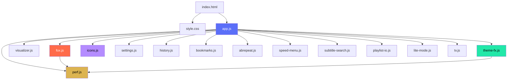
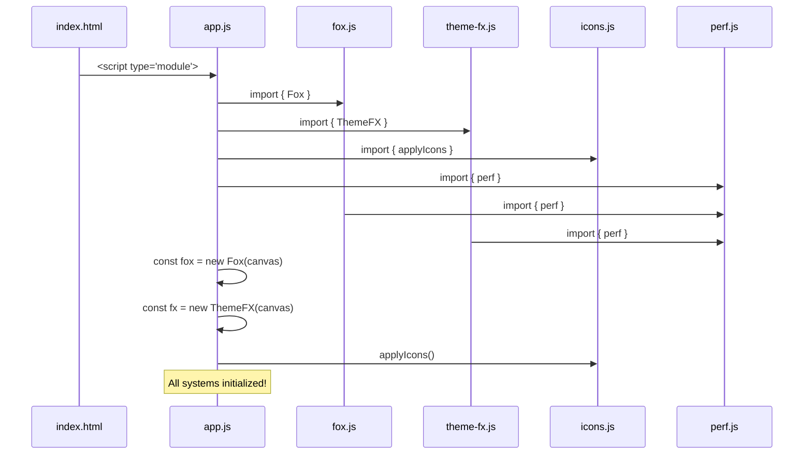
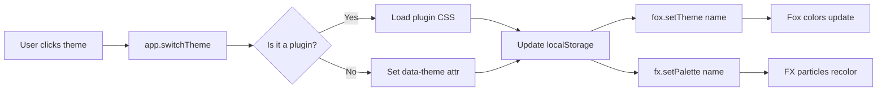
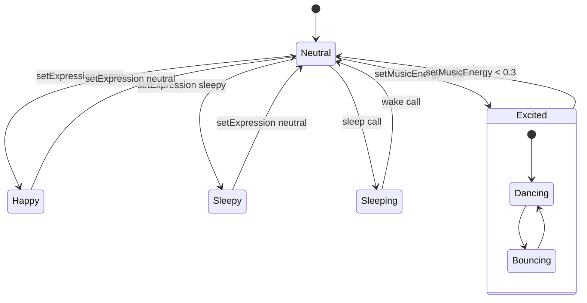

# BM Player v2.2.0 Enhanced — Architecture & Wiring Guide

## 📋 Table of Contents
1. [Overview](#overview)
2. [Project Structure](#project-structure)
3. [File Dependency Graph](#file-dependency-graph)
4. [Core Systems Explained](#core-systems-explained)
5. [JavaScript Module Wiring](#javascript-module-wiring)
6. [Theme System Architecture](#theme-system-architecture)
7. [Fox Mascot System](#fox-mascot-system)
8. [Visual Effects Engine](#visual-effects-engine)
9. [Plugin System](#plugin-system)
10. [Electron Integration](#electron-integration)
11. [CSS Architecture](#css-architecture)
12. [Performance System](#performance-system)

---

## Overview

BM Player is a feature-rich media player built with **Electron.js** for desktop deployment, using **Three.js** for 3D graphics (Fox mascot), **Canvas 2D** for visual effects, and **ES6 modules** for clean code organization.

### Key Technologies
- **Electron** — Desktop application framework (main process + renderer process)
- **Three.js** — 3D rendering for Fox mascot
- **HTML5 Canvas 2D** — Theme FX fluid simulation
- **CSS Custom Properties** — Dynamic theming system
- **Web Audio API** — Audio visualization (via Visualizer module)

---

## Project Structure

```
BM-Player-v2.2.0-Enhanced/
├── main.js                    # Electron main process entry point
├── preload.js                 # Electron preload script (IPC bridge)
├── package.json               # Node.js dependencies & app metadata
├── electron-builder.yml       # Full build configuration
├── electron-builder.lite.yml  # Lite build configuration
│
├── src/
│   ├── index.html             # Main HTML shell
│   ├── css/
│   │   └── style.css          # Complete stylesheet (v2.2.0 enhanced)
│   └── js/
│       ├── app.js             # Main application controller ⭐
│       ├── fox.js             # Three.js Fox mascot (v2.2.0 enhanced) ⭐
│       ├── theme-fx.js        # Canvas 2D visual effects engine ⭐
│       ├── icons.js           # SVG icon definitions & renderer
│       ├── visualizer.js      # Web Audio visualization
│       ├── perf.js            # Performance/quality tier system
│       └── modules/
│           ├── settings.js    # Settings persistence & UI
│           ├── history.js     # Playback history
│           ├── bookmarks.js   # Bookmark management
│           ├── abrepeat.js    # A-B repeat functionality
│           ├── speed-menu.js  # Playback speed controls
│           ├── subtitle-search.js  # Subtitle finder
│           ├── playlist-io.js # M3U playlist import/export
│           ├── lite-mode.js   # Low-spec performance mode
│           └── tv.js          # IPTV/TV mode
│
├── plugins/                   # Theme & feature plugins
│   ├── cyberpunk-theme/       # NEW: Cyberpunk neon theme
│   ├── forest-theme/          # NEW: Forest natural theme
│   ├── lavender-theme/        # NEW: Lavender dreamy theme
│   ├── golden-theme/          # NEW: Golden luxury theme
│   ├── ocean-theme/           # NEW: Ocean deep theme
│   ├── sakura-theme/          # NEW: Cherry blossom theme
│   ├── midnight-theme/        # NEW: Midnight star theme
│   ├── sunset-theme/          # Warm sunset theme
│   └── example-nowplaying-stats/  # Example plugin
│
├── buildResources/            # Installer assets
│   ├── icon.png               # App icon
│   ├── installer.nsh          # NSIS installer script
│   └── installer.lite.nsh     # Lite installer script
│
├── assets/
│   └── icon-source.png        # High-res source icon
│
└── scripts/
    └── generate-icon.js       # Icon generation utility
```

---

## File Dependency Graph



---

## Core Systems Explained

### 1. Main Application Controller (`app.js`)

**Role:** Central orchestrator that wires all modules together.

**Key Responsibilities:**
- Initializes all subsystems on DOMContentLoaded
- Manages playback state (play/pause/stop/seek)
- Handles keyboard shortcuts and global events
- Coordinates between UI, audio, and visual effects
- Manages theme switching

**Initialization Flow:**
```javascript
// Pseudocode from app.js structure
import { Fox } from './fox.js';
import { ThemeFX } from './theme-fx.js';
import { applyIcons } from './icons.js';

// On DOM ready:
// 1. Create Fox instance → attaches to #fox-canvas
// 2. Create ThemeFX instance → attaches to #fx-canvas  
// 3. Call applyIcons() → renders SVG icons to buttons
// 4. Initialize settings from localStorage
// 5. Set up event listeners for all UI elements
// 6. Apply saved theme
```

**Key Functions:**
| Function | Purpose |
|----------|---------|
| `init()` | Main initialization entry point |
| `loadMedia(src)` | Load audio/video file or URL |
| `togglePlay()` | Play/pause toggle |
| `seek(pos)` | Seek to position (0-1) |
| `setVolume(v)` | Set volume (0-1) |
| `switchTheme(name)` | Change active theme |
| `handleShortcut(e)` | Process keyboard shortcuts |

---

### 2. Fox Mascot System (`fox.js`)

**Role:** 3D animated fox character using Three.js.

**Architecture:**
```
Fox Class
├── Scene Setup
│   ├── PerspectiveCamera (FOV: 38)
│   ├── WebGLRenderer (alpha: true)
│   └── Scene with ambient + directional lights
│
├── Fox Geometry (Low-poly faceted style)
│   ├── Head Group
│   │   ├── Icosahedron head (crown color)
│   │   ├── Cone cheeks (gray)
│   │   ├── Cone snout (crown)
│   │   ├── Jaw (cream) - animates for yawning
│   │   ├── Nose (emissive glow material)
│   │   ├── Ears (2-tone cones)
│   │   ├── Eyes (cone geometry)
│   │   ├── Fangs (hidden normally)
│   │   └── Whiskers (thin cylinders)
│   ├── Body Group
│   │   ├── Torso (tapered cylinder)
│   │   └── Chest blaze (cream)
│   ├── Tail Group
│   │   └── 7-segment chain of icosahedrons
│   └── Paw Group
│       ├── Front paws (2)
│       └── Back paws (2)
│
├── Animation Systems
│   ├── Head tracking (follows mouse)
│   ├── Blinking (random interval)
│   ├── Ear twitching (reactive)
│   ├── Tail wagging (music energy driven)
│   ├── Body bobbing (breathing + music)
│   ├── Yawning (idle animation)
│   ├── Boop reaction (click detection)
│   ├── Dance mode (high energy)
│   └── Expression changes
│
├── Particle Systems
│   ├── Sparkle particles (Points object)
│   ├── Boop hearts (v2.2.0 new)
│   └── Sleep ZZZs (v2.2.0 new)
│
└── Theme System
    └── Per-theme color palettes (15 themes!)
```

**Public API:**
```javascript
const fox = new Fox(document.getElementById('fox-canvas'));

// Control states
fox.sleep();           // Put fox to sleep
fox.wake();            // Wake fox up
fox.pause();           // Pause animations
fox.resume();          // Resume animations

// Reactivity
fox.setMusicEnergy(0.7);  // 0-1 value from audio analysis
fox.setExpression('happy'); // 'neutral' | 'happy' | 'sleepy' | 'excited'
fox.setTheme('cyberpunk'); // Change color palette
```

**v2.2.0 Enhancements:**
- ✨ **Boop Hearts** - Clicking the fox spawns floating hearts
- 💤 **Sleep ZZZs** - Animated Z letters float up when sleeping
- 💃 **Dance Mode** - Fox bounces and sways at high music energy
- 🎨 **15 Theme Palettes** - Including cyberpunk, forest, lavender, golden
- 😊 **Excitement System** - Cumulative excitement affects animations
- 👀 **Double Blink** - Random chance of cute double-blink

---

### 3. Visual Effects Engine (`theme-fx.js`)

**Role:** Canvas 2D particle system for background ambiance.

**Modes:**

| Mode | Description | Best For |
|------|-------------|----------|
| `'fluid'` | Universal particle fluid simulation | All themes (default) |
| `'blood'` | Dripping blood strands | Dracula theme only |
| `'off'` | Nothing rendered | Performance / preference |

**Fluid Simulation Architecture:**
```
ThemeFX Class
├── Particle Pool
│   └── Dye[] particles with:
│       ├── x, y position
│       ├── vx, y velocity
│       ├── colorIdx (which palette color)
│       ├── alpha (transparency)
│       ├── size (render size)
│       └── phase (animation offset)
│
├── Physics Engine
│   ├── Curl noise flow field (3-octave FBM)
│   ├── Mouse attraction/repulsion
│   ├── Edge wrapping
│   └── Velocity damping (0.94)
│
├── Ripple System
│   ├── Click/touch burst ripples
│   ├── Mouse trail ripples
│   └── Particle push from bursts
│
├── Rendering Pipeline
│   ├── Trail fade (destination-out composite)
│   ├── Ripple rings (source-over)
│   ├── Connection lines (lighter blend)
│   ├── Particles (screen blend)
│   └── Cursor glow (radial gradient)
│
└── Theme Palettes (15 total!)
    └── Each theme has 5-7 RGB colors
```

**Performance Tiers:**
| Tier | Particles | Ripples | Connections | Target Hardware |
|------|-----------|---------|-------------|-----------------|
| Low | 120 | 5 | No | Integrated graphics / 4GB RAM |
| Medium | 300 | 15 | No | Standard laptop |
| High | 600 | 30 | Yes | Dedicated GPU |

---

### 4. Icons System (`icons.js`)

**Role:** SVG icon definitions and DOM injection.

**How it works:**
1. Defines all icons as SVG strings in `ICONS` object
2. `applyIcons()` function finds buttons by ID and injects SVG
3. Toggle pairs handle play/pause, mute/unmute states

**Icon Categories:**
- **Playback**: play, pause, stop, prev, next, rew, fwd
- **Volume**: volHigh, volMuted, volLow
- **Window Controls**: minimize, maximize, restore, close
- **Titlebar Buttons**: pip, theatre, settings, shortcuts
- **Mode Icons**: video, music, images, pdf, tv
- **Utility**: fullscreen, info, eq, playlist
- **Context Menu**: playFile, folder, copy, addToQ
- **Misc**: heart, clock, bookmark, search, sort, filter, star, check, etc.

**Usage in other files:**
```javascript
import { ICONS, applyIcons, setTogglePair } from './icons.js';

// Get SVG string for custom use
const playIcon = ICONS.play;

// Apply all icons to DOM buttons
applyIcons();

// Toggle between paired icons (play ↔ pause)
setTogglePair('btn-play', true);  // Show pause icon
setTogglePair('btn-play', false); // Show play icon
```

---

## JavaScript Module Wiring

### Import Chain Diagram



### ES6 Module Exports Summary

| File | Exports | Used By |
|------|---------|---------|
| `fox.js` | `class Fox` | app.js |
| `theme-fx.js` | `class ThemeFX` | app.js |
| `icons.js` | `ICONS`, `applyIcons()`, `setTogglePair()` | app.js |
| `perf.js` | `perf` (singleton), `QUALITY_TIERS` | fox.js, theme-fx.js, app.js |
| `settings.js` | `default` (object) | app.js |
| `history.js` | `default` (object) | app.js |
| `bookmarks.js` | `class Bookmarks` | app.js |
| `abrepeat.js` | `class ABRepeat` | app.js |
| `speed-menu.js` | `SpeedMenu`, `SPEED_PRESETS` | app.js |
| `subtitle-search.js` | `class SubtitleSearch` | app.js |
| `playlist-io.js` | Parser functions | app.js |
| `lite-mode.js` | `default` (object) | app.js |
| `tv.js` | `class TVModule` | app.js |

---

## Theme System Architecture

### How Themes Work

1. **CSS Custom Properties** defined per theme in `style.css`
2. **Theme switching** sets `data-theme` attribute on `<html>` element
3. **All components** read from CSS variables automatically
4. **Plugin themes** can add additional CSS overrides

### Available Themes (v2.2.0)

| Theme Key | Name | Primary Color | Accent Color | Style |
|-----------|------|---------------|--------------|-------|
| `dark` | Dark Blue | #5B6FF8 | #00D4FF | Professional default |
| `light` | Light | #4757e3 | #0098cf | Clean bright |
| `glass` | Glassmorphism | #8d7bff | #43e0ff | Frosted glass |
| `dracula` | Dracula | #ff4d6d | #bd5cff | Vampire pink/purple |
| `northern` | Northern Lights | #22e8a8 | #3aa8ff | Aurora greens/blues |
| `ocean` | Ocean Deep | #1a8fcc | #00d4ff | Aquatic blues |
| `sunset` | Sunset Warm | #ff6b4a | #ffb347 | Orange warmth |
| `sakura` | Sakura Pink | #f5a0c0 | #ffb0d0 | Cherry blossoms |
| `midnight` | Midnight | #4a5fcf | #7890ff | Deep space blue |
| `cyberpunk` | Cyberpunk | #ff0080 | #00ffff | Neon synthwave 🔥NEW |
| `forest` | Forest | #50c878 | #98d85a | Natural greens 🔥NEW |
| `lavender` | Lavender | #b48cff | #ff80bf | Dreamy purple-pink 🔥NEW |
| `golden` | Golden | #dcb450 | #f0a030 | Luxury gold 🔥NEW |

### Theme Plugin Structure

Each theme plugin is a folder containing:
```
plugin-name/
├── plugin.json    # Metadata (name, type, themeKey, entry file)
└── theme.css      # Additional CSS overrides (optional)
```

**Example plugin.json:**
```json
{
  "name": "Cyberpunk Theme",
  "version": "1.0.0",
  "type": "theme",
  "themeKey": "cyberpunk",
  "entry": "theme.css"
}
```

### Theme Switching Code Flow



---

## Fox Mascot System (Detailed)

### Animation State Machine



### Per-Theme Fox Colors

The `PAL` object in `fox.js` defines colors for each theme:

```javascript
const PAL = {
  dark:     { crown: 0xe8732a, cream: 0xfff3e0, gray: 0xaab0bc, dark: 0x1a1410 },
  cyberpunk:{ crown: 0xff0080, cream: 0xffe0f0, gray: 0xaa6688, dark: 0x200010 },
  forest:   { crown: 0x50c878, cream: 0xf0ffe8, gray: 0x88aa90, dark: 0x1a2810 },
  // ... etc for all 15 themes
};
```

**Color Mapping:**
- `crown` → Head top, body main, tail segments
- `cream` → Muzzle, ear inner, chest, tail tip
- `gray` → Cheeks, subtle shading
- `dark` → Nose, eyes, paws, whiskers
- `accent` → Glow effects, special highlights

---

## Visual Effects Engine (Detailed)

### Curl Noise Explanation

The fluid simulation uses **curl noise** to create divergence-free flow fields:

```
Given noise function N(x, y, t):
  curl(N) = (∂N_y/∂x - ∂N_x/∂y)

This ensures:
  ✓ Fluid-like organic motion
  ✓ No compression/expansion artifacts
  ✓ Smooth continuous flow
```

### Multi-Octave FBM (Fractal Brownian Motion)

```
3 octaves of sine-based noise:
  Octave 1: Base frequency, full amplitude
  Octave 2: 1.7× frequency, 0.5× amplitude  
  Octave 3: 3.4× frequency, 0.25× amplitude

Result: Rich, detailed flow patterns
```

---

## Plugin System

### How Plugins Work

1. **Scanning**: `main.js` scans two directories:
   - `<app>/plugins` — Bundled plugins
   - `<userData>/plugins` — User-installed plugins

2. **Loading**: For each folder found:
   - Read `plugin.json` for metadata
   - Check enable/disable state from `plugins-state.json`
   - If enabled and type matches, load the entry file

3. **Theme Plugins**:
   - Entry CSS file is injected into `<head>`
   - Theme appears in theme selector UI
   - Setting `data-theme` activates it

### Creating a New Theme Plugin

1. Create folder: `plugins/my-theme/`
2. Add `plugin.json`:
```json
{
  "name": "My Theme",
  "version": "1.0.0",
  "type": "theme",
  "themeKey": "my-theme",
  "author": "Your Name",
  "entry": "theme.css"
}
```
3. Add `theme.css` with your custom properties
4. Add palette to both `style.css` AND `fox.js` PAL object AND `theme-fx.js` THEME_PALETTES

---

## Electron Integration

### Main Process (`main.js`)

**Responsibilities:**
- Window creation and management
- Menu bar setup
- File dialog handling
- IPC (Inter-Process Communication) handlers
- Plugin scanning and loading
- Auto-updater integration

### Preload Script (`preload.js`)

**Purpose:** Secure bridge between renderer and main process

**Exposed APIs via contextBridge:**
- File operations (open, save)
- Window controls (minimize, maximize, close)
- App info (version, path)
- Plugin management

### IPC Channels

| Channel | Direction | Purpose |
|---------|-----------|---------|
| `dialog:open` | Renderer → Main | Open file dialog |
| `dialog:save` | Renderer → Main | Save file dialog |
| `window:minimize` | Renderer → Main | Minimize window |
| `window:maximize` | Renderer → Main | Toggle maximize |
| `window:close` | Renderer → Main | Close window |
| `app:version` | Main → Renderer | Get app version |

---

## CSS Architecture

### Custom Property System

All theming uses CSS custom properties (variables):

```css
:root[data-theme="dark"] {
  --bg: #080b14;         /* Main background */
  --bg2: #0d1120;        /* Secondary background */
  --surface: #111624;     /* Card/panel background */
  --surface2: #161c2e;    /* Hover surface */
  --border: rgba(...);    /* Border color */
  --text: #e4eaf6;        /* Primary text */
  --text-muted: #6b7a99;  /* Secondary text */
  --accent: #5B6FF8;      /* Primary accent */
  --accent2: #00D4FF;     /* Secondary accent */
  --accent-glow: ...;     /* Glow/shadow color */
  --bar-bg: ...;          /* Bar backgrounds */
  --hover: ...;           /* Hover states */
  --menu-bg: ...;         /* Context menus */
  --danger: #ef4444;      /* Error/danger */
}
```

### Animation Library (v2.2.0)

New keyframe animations added:

| Animation | Use Case | Duration |
|-----------|----------|----------|
| `fadeIn` | General appearance | 0.4s ease |
| `slideUp` | Content entrance | 0.8s ease |
| `slideDown` | Header entrance | 0.8s ease |
| `scaleIn` | Modals/popups | 0.3s ease |
| `pulse` | Loading/badges | 2s infinite |
| `glow` | Active elements | 3s infinite |
| `shimmer` | Gradient movement | 2s linear |
| `float` | Fox container | 4s ease-in-out |
| `rotate` | Spinners/rings | 1s linear |
| `bounce` | Button feedback | 1s ease |
| `ripple` | Click ripples | 0.6s linear |
| `gradientShift` | Animated gradients | 3s linear |

---

## Performance System

### Quality Tiers (`perf.js`)

Auto-detection based on hardware:

```javascript
function autoDetectTier() {
  const cores = navigator.hardwareConcurrency || 4;
  const mem   = navigator.deviceMemory || 8;
  
  if (mem <= 4 || cores <= 2) return 'low';    // Weak hardware
  if (mem <= 8 || cores <= 4) return 'medium';  // Standard
  return 'high';                                 // Powerful
}
```

### Tunable Parameters

| Parameter | Low | Medium | High | Effect |
|-----------|-----|--------|------|--------|
| `density` | 70 | 180 | 340 | Visual richness |
| `speedScale` | 0.75 | 1.0 | 1.2 | Animation speed |
| `glow` | 0.65 | 1.0 | 1.25 | Glow intensity |
| `trail` | 0.75 | 1.0 | 1.15 | Trail length |

### User Override

Users can manually adjust each parameter from Settings > Performance panel.

---

## Quick Reference: Common Tasks

### Adding a New Button with Icon

```html
<button id="btn-myfeature" class="ctrl-btn" title="My Feature"></button>
```

```javascript
// In icons.js, add to ICONS object:
myFeature: S(`<path d="..." fill="currentColor"/>`),

// In byId map inside applyIcons():
'my-feature': ICONS.myFeature,
```

### Adding a New Theme

1. Add CSS variables to `style.css`: `:root[data-theme="mytheme"]{...}`
2. Add palette to `fox.js` PAL: `mytheme: { crown: ..., cream: ..., ... }`
3. Add palette to `theme-fx.js` THEME_PALETTES: `mytheme: [[r,g,b],...]`
4. (Optional) Create plugin folder with `plugin.json` + `theme.css`

### Connecting Audio to Fox Energy

```javascript
// In your audio analyzer callback:
const energy = calculateEnergy(frequencyData); // 0-1
fox.setMusicEnergy(energy);
fx.setMode('fluid'); // Ensure effects are running
```

---

## Troubleshooting

### Issue: Fox not showing
- Check THREE.js is loaded globally (`window.THREE`)
- Verify canvas element exists with correct ID
- Check console for WebGL errors

### Issue: Theme not applying
- Ensure `data-theme` attribute is set on `<html>`
- Check CSS file is loaded
- Verify CSS variable names match exactly

### Issue: Effects lagging
- Open Settings > Performance
- Lower quality tier
- Try "Lite Mode" toggle

### Issue: Window controls not working
- Check `preload.js` is correctly configured
- Verify IPC channels are registered in `main.js`
- Check `-webkit-app-region: drag` isn't covering buttons

---

*Document version: 2.2.0*
*Last updated: July 2026*
*For BM Player v2.2.0 Enhanced*
