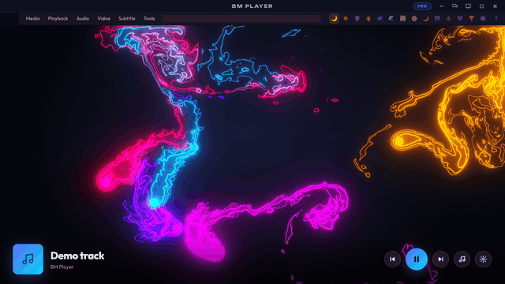
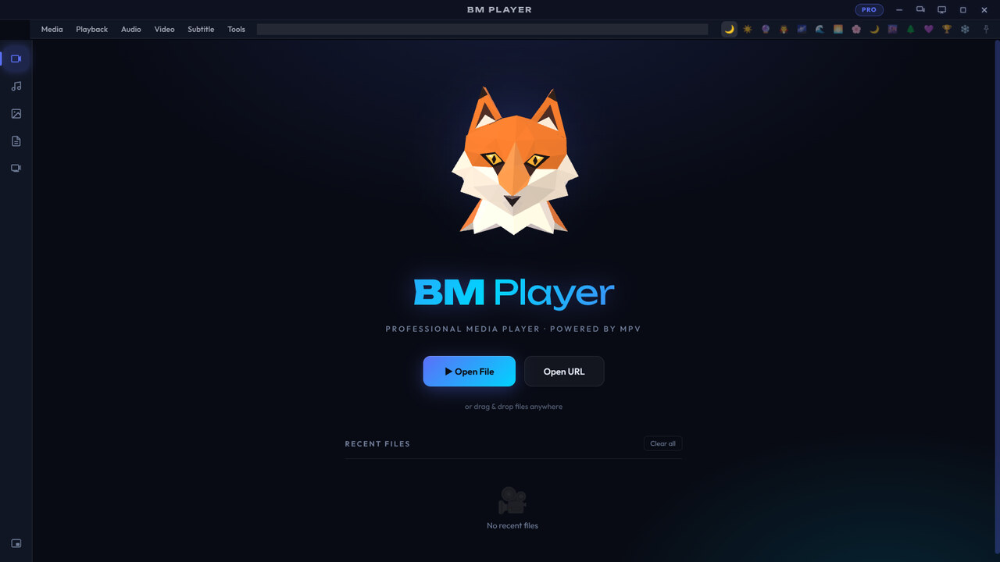
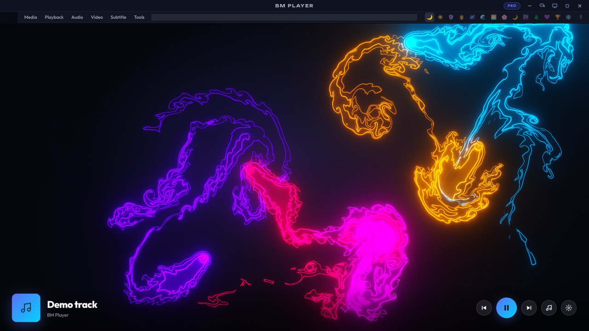
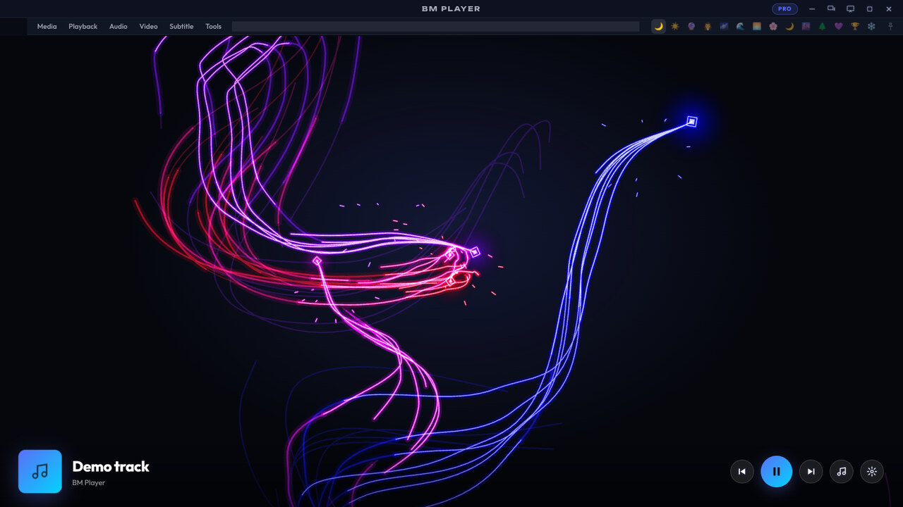
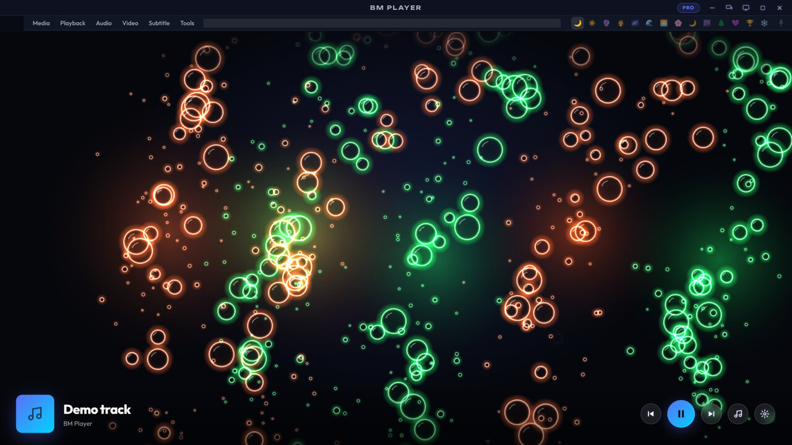
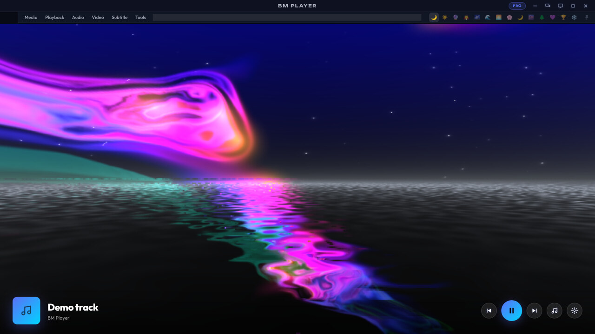
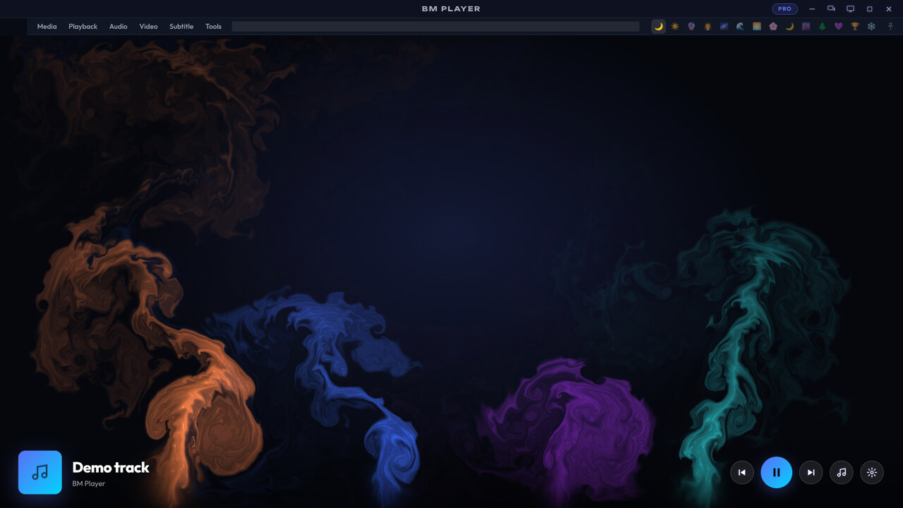
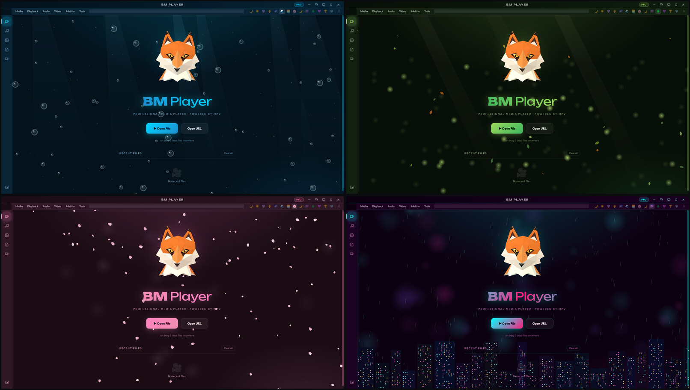

<p align="center">
  
</p>

# BM Player

A desktop media player built on [Electron](https://www.electronjs.org), with
[mpv](https://mpv.io) doing the playback. It plays video and music, and has an
image gallery, PDF tools, IPTV, 14 themes, a music visualiser in nine styles
and a plugin system.

[](https://github.com/BritMat/bm-player/actions/workflows/ci.yml)


## A look at it

<table>
  <tr>
    <td width="50%"><br><sub>The home screen</sub></td>
    <td width="50%"><br><sub>HD Flow: a fluid stirred by the music, in neon lines</sub></td>
  </tr>
  <tr>
    <td><br><sub>Neon: lanterns trailing lines of light</sub></td>
    <td><br><sub>Bubbles: they swell on the beat</sub></td>
  </tr>
  <tr>
    <td><br><sub>MilkDrop: the classic presets</sub></td>
    <td><br><sub>Smoke</sub></td>
  </tr>
  <tr>
    <td colspan="2"><br><sub>Four of the 14 themes: Ocean, Forest, Sakura and Cyberpunk, each with a scene of its own</sub></td>
  </tr>
</table>

Every picture here is the app itself, drawing to a test track.

## Download

Get the latest version from the **[Releases page](https://github.com/BritMat/bm-player/releases)**.
You only need one file.

**Windows (64-bit):** `BM-Player-Setup-<version>-x64.exe`. While it installs,
it downloads mpv from mpv's Windows builds on GitHub and checks it against the
build tested for that release, so it needs an internet connection. The
installer is not code-signed yet, so Windows SmartScreen may warn: choose
**More info**, then **Run anyway**.

**BM Player Lite (Windows, 64-bit):** `BM-Player-Lite-Setup-<version>-x64.exe`.
A lighter version for older or low-spec PCs, with simpler visuals, one window,
and the picture above a fixed control bar. It installs alongside the full
version.

**Linux (64-bit):** on Ubuntu or Debian, install
`BM-Player-<version>-amd64.deb` with `sudo apt install ./BM-Player-<version>-amd64.deb`,
which installs mpv too. On other distributions, install mpv from your package
manager, then make `BM-Player-<version>-x86_64.AppImage` executable and run it.

**macOS (experimental):** `BM-Player-<version>-arm64.dmg` for Apple Silicon,
`BM-Player-<version>-x64.dmg` for Intel. Install mpv first with
`brew install mpv`. The app is not notarized by Apple, so the first time,
open System Settings, Privacy & Security, and choose **Open Anyway**. Video
playback has not been tested on a Mac yet.

The `latest.yml`, `latest-linux.yml` and `.blockmap` files on a release are
read by BM Player's built-in updater. You don't need to download them.

## What it does

- Plays video with mpv: subtitles, audio tracks, chapters, A-B loop,
  screenshots, playback speed, an equalizer, and resume where you left off.
- Turns the picture a quarter at a time (Ctrl+R, and Ctrl+Shift+R the other
  way) and mirrors it (Ctrl+M), for a phone video filmed on its side or a
  selfie camera. Each new file starts straight.
- Full screen on the whole screen, with F, F11 or a double-click on the
  picture. The controls and the pointer leave while the pointer is still.
- A music library with tag reading, playlists (including M3U), its own
  playback speed (0.25x to 3x, the pitch kept) and a visualizer.
- Lyrics that follow the song, with the line being sung lit, in Now Playing
  and over the visualizer. They come from a .lrc file beside the song, then
  the song's own tags, then [LRCLIB](https://lrclib.net) online. Only the
  artist, title, album and length are sent, each answer is kept so a song
  is looked up once, and looking online can be switched off.
- An image gallery, PDF tools and IPTV.
- Picture-in-picture, in a small window that stays on top.
- 14 themes: four standard ones (Dark, Light, Dracula and Snow), Flow (a flowing
  fluid of light whose colours, intensity, size, swirl and trails you can set), and
  nine artistic ones, each with an animated scene of its own: ocean light and
  bubbles, forest fireflies, city lights in neon rain, falling cherry blossom, and
  more. And a 3D fox mascot.
- Keyboard shortcuts for nearly everything: press ? (or F1) in the app for the list.
- Pro or Lite, switched with one press of the button by the window controls.
- An audio visualiser that shows the music as it plays, its real frequencies
  and its beat, in nine styles, among them HD Flow (a fluid stirred by the
  music, and by your pointer, drawn as neon lines in the screen's own pixels),
  MilkDrop (a chosen set of the classic presets, through butterchurn), Neon,
  Bubbles and Smoke, with the album art in Radial's middle, and settings for
  its style, colours, sensitivity and bars. The heavier styles step their
  quality down by themselves on a machine that cannot keep up. And subtitles
  in the font and colour you choose.
- Plugins: themes and scripts you add yourself (see below).
- Lite mode for weak hardware: lighter visuals, switched on automatically on
  low-spec machines and available as a setting in any build.

## If something goes wrong

Open the menu, choose **Diagnostics…**, then **Copy report**. It lists
versions, where mpv was found, the graphics features available and recent
errors. Paste it into a
[new issue](https://github.com/BritMat/bm-player/issues) with what you were
doing when it happened.

## Building from source

You need [Node.js](https://nodejs.org) 22.12 or newer, and mpv on your `PATH`
(or its files in `vendor/mpv/`).

```bash
npm ci
npm start              # the app
npm run start:lite     # the one-window Lite layout
npm test               # the automated checks
```

To build installers, generate the icons first, then build for your platform:

```bash
npm run gen-icon
npm run build:win64        # or build:linux, build:mac, build:lite-win64
```

The installers land in `dist/`. GitHub Actions builds and publishes every
release from its version tag (`.github/workflows/ci.yml`).

## Plugins

Press **Folder** in the Plugins panel to open your plugins folder. BM Player
puts a README and two samples there: a theme and a script. Theme styles are
cleaned before use, and a script plugin you add stays switched off until you
approve it, and switches off again if its files change.

## License

MIT, see [LICENSE](LICENSE). The Unbounded and Outfit fonts in `src/fonts` are
bundled under the SIL Open Font License 1.1. mpv is a separate project with its own license,
downloaded from its Windows builds on GitHub or installed from your system's
package manager.

## Credits

The MilkDrop style uses [butterchurn](https://github.com/jberg/butterchurn) and
[butterchurn-presets](https://github.com/jberg/butterchurn-presets), both MIT
licensed (src/vendor/milkdrop/LICENSE.txt).

Online lyrics come from [LRCLIB](https://lrclib.net), a free and open
collection of lyrics.

The fluid (behind the home screen, and in the Smoke and HD Flow styles) follows
the method of [WebGL Fluid Simulation](https://github.com/PavelDoGreat/WebGL-Fluid-Simulation)
by Pavel Dobryakov, MIT licensed (src/vendor/webgl-fluid/LICENSE.txt).
